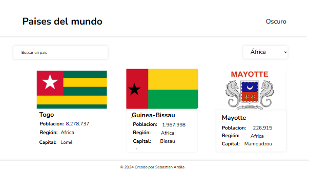
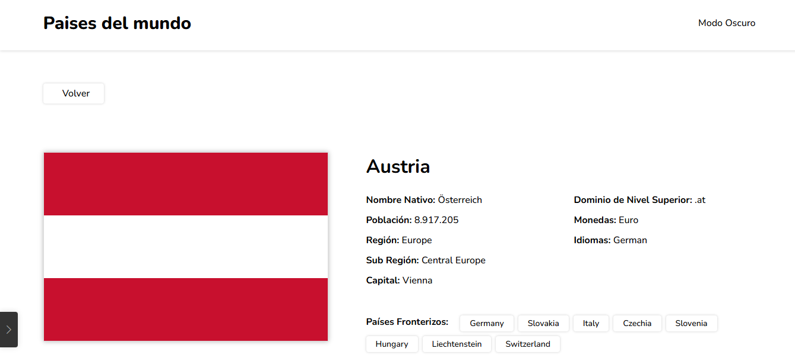
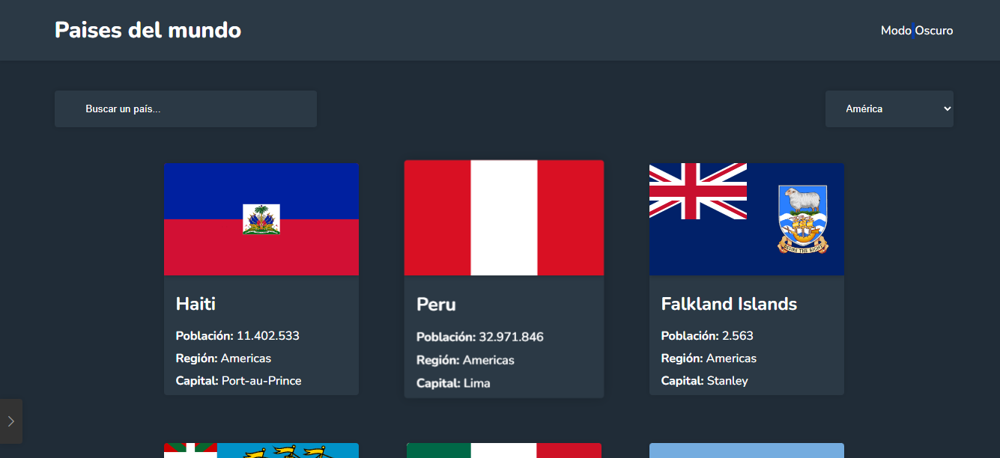

# 🌍 ¿Dónde en el mundo?

¡Bienvenido a "Dónde en el mundo?", una aplicación web simple y amigable para explorar información sobre países de todo el mundo! Puedes buscar países, filtrarlos por región y ver los detalles de cada uno.

Este proyecto es ideal para quienes están empezando a aprender desarrollo web y quieren ver cómo se consume una API y se manipula el DOM con JavaScript puro.

## ✨ Características

* **Ver todos los países:** Muestra una lista de tarjetas con banderas, nombres, población, región y capital.
* **Buscar países:** Escribe en la barra de búsqueda para encontrar países por su nombre.
* **Filtrar por región:** Usa el menú desplegable para ver países de una región específica (África, América, Asia, Europa, Oceanía).
* **Ver detalles del país:** Haz clic en cualquier tarjeta de país para ver información más detallada, como nombre nativo, monedas, idiomas y países fronterizos.
* **Modo Oscuro:** Cambia el tema de la aplicación para una mejor experiencia visual en diferentes condiciones de luz.
* **Diseño Responsivo:** La aplicación se ve bien en dispositivos de escritorio y móviles.

## 🎨 Diseño Visual (Maquetación)

### Página Principal




### Detalles de un País


_Información detallada de un país específico, con sus fronteras._

### Modo Oscuro


_Así se ve la aplicación cuando el modo oscuro está activado._

La maquetación visual de este proyecto fue diseñada utilizando **Canva**. Puedes explorar el diseño original y su estructura a través del siguiente enlace:

[Ver Maquetación en Canva](https://www.canva.com/design/DAGqqCIw9W8/xSWLCITNwhc39TX3C9wMfA/edit?utm_content=DAGqqCIw9W8&utm_campaign=designshare&utm_medium=link2&utm_source=sharebutton)

## 🚀 Tecnologías Usadas

* **HTML5:** Estructura de las páginas web.
* **CSS3:** Estilos y diseño, incluyendo modo oscuro y adaptabilidad.
* **JavaScript (ES6+):** Lógica de la aplicación, consumo de la API y manipulación del DOM.
* **[Restcountries API](https://restcountries.com/):** La fuente de datos para toda la información de los países.
* **[Font Awesome](https://fontawesome.com/):** Iconos (como la lupa y la luna).
* **[Google Fonts (Nunito)](https://fonts.google.com/specimen/Nunito):** Fuente de texto para un diseño agradable.

## ⚙️ Cómo Ejecutar el Proyecto (para estudiantes)

¡Es muy fácil probar este proyecto en tu propia computadora!

1.  **Clona el repositorio:**
    Abre tu terminal (o la línea de comandos) y escribe:
    ```bash
    git clone [https://github.com/TU_USUARIO/TU_REPOSITORIO.git](https://github.com/TU_USUARIO/TU_REPOSITORIO.git)
    ```
    (Recuerda reemplazar `TU_USUARIO` con tu nombre de usuario de GitHub y `TU_REPOSITORIO` con el nombre de tu repositorio donde tienes este proyecto).

2.  **Entra a la carpeta del proyecto:**
    ```bash
    cd TU_REPOSITORIO
    ```

3.  **Abre `index.html`:**
    Simplemente abre el archivo `index.html` en tu navegador web favorito (Chrome, Firefox, Edge, etc.). Puedes hacer doble clic en el archivo desde tu explorador de archivos.

¡Eso es todo! La aplicación debería cargar y mostrar todos los países.

## 🚧 Posibles Mejoras (Ideas para seguir aprendiendo)

Si quieres llevar este proyecto al siguiente nivel, aquí tienes algunas ideas:

* **Paginación:** Si hay muchos países, podrías mostrar solo un número limitado por página.
* **Ordenar resultados:** Añadir opciones para ordenar los países por población, área, o alfabéticamente.
* **Carga de Spinner/Estado de Carga:** Mostrar un pequeño mensaje o animación mientras se cargan los datos de la API.
* **Manejo de Errores Visual:** Mostrar un mensaje amigable al usuario si la API falla o no se encuentran resultados.
* **Guardar Preferencia de Tema:** Recordar si el usuario prefiere el modo oscuro o claro usando `localStorage`.

## 👨‍💻 Creado por

**Sebastian Ardila**

---